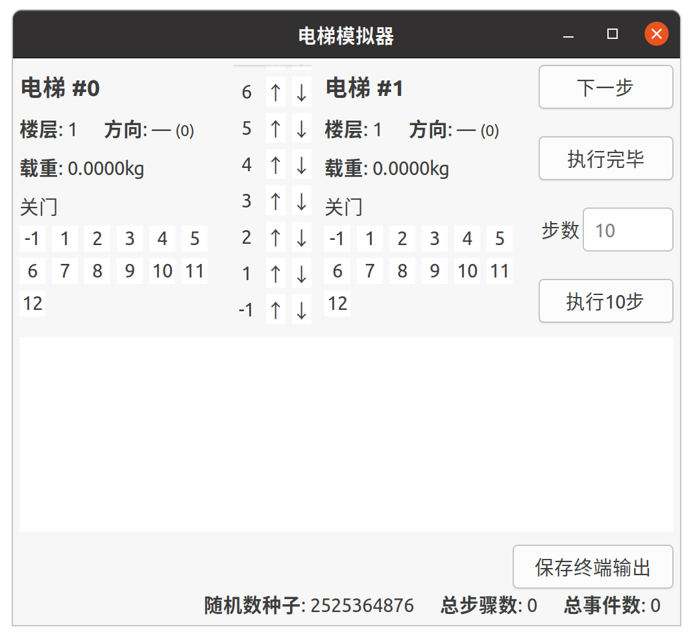

# 电梯模拟器 Lift Simulator

中国科大 2021 秋 数据结构（011127.01） 实验 01

## 生成

编译本程序需要 CMake 、pkg-config 和支持 C++ 17 的编译器。本程序的图形界面使用 Gtkmm 3.0 实现。在编写本程序时，我没有考虑跨操作系统的移植性，所以本程序只适合在 Linux 上使用，我不保证本程序在其他操作系统上也能成功编译并正确运行。

```sh
mkdir build && cd build
cmake .. -DCMAKE_BUILD_TYPE=Release
cmake --build . --config Release
```

编译的输出位于`build\output`。

### 库依赖

1. Gtkmm 3.0 （`libgtkmm-3.0-dev/focal,now 3.24.2-1build1 amd64`）

## 使用方法

双击`bin/电梯模拟器.AppImage`（这其实并不是App Image，但`.AppImage`是我知道的唯一的在GNOME桌面环境下可以直接双击运行的动态可执行文件拓展名，其他拓展名会被识别成动态库而无法执行）即可运行，或者也可以在终端中输入`<软件的路径>/bin/电梯模拟器.AppImage`。软件界面简洁直观，无需额外解释。



在通过命令行启动时，命令可以带一个参数——随机数种子，即`<软件的路径>/bin/电梯模拟器.AppImage <随机数种子>`。这是唯一的复现程序运行结果的方法。指定种子时，参数个数必须为2，即不能含有多余的参数，否则程序会忽略随机数种子。随机数种子必须是无符号十进制整数，否则程序会抛出`std::invalid_argument`异常，然后崩溃：

```sh
$ ./电梯模拟器.AppImage --help
terminate called after throwing an instance of 'std::invalid_argument'
  what():  stoull
已放弃 (核心已转储)
```

## 放弃著作权声明

**本声明仅适用于软件本身，不适用于随本软件发布其他文件（位于`ext`目录）。**

我，电梯模拟器的作者张子辰，放弃关于本软件的著作权，并将本软件发布到公有领域。如果这不合法，那么兹授权，以任何目的——商业的或非商业的、通过任何媒介，使用、复制、修改、编译、出售和/或分发本软件。

【本软件照“原样”提供，不含任何担保，包括但不限于适销性、适合于特定的目的和不侵权。】

I, 张子辰, the author of Lift Simulator, give up my copyright for this software and release this software into public domain. If this is illegal, then permission is granted to use, copy, modify, compile, sell and/or distribute this software, for any purpose, commercial of non-commercial, and in any media.

THIS SOFTWARE IS OFFERED “AS IS”, WITHOUT ANY WARRANTY, INCLUDING BUT NOT LIMITED TO MERCHANTABILITY, FITNESS FOR A PARTICULAR PURPOSE AND NONINFRINGEMENT.

